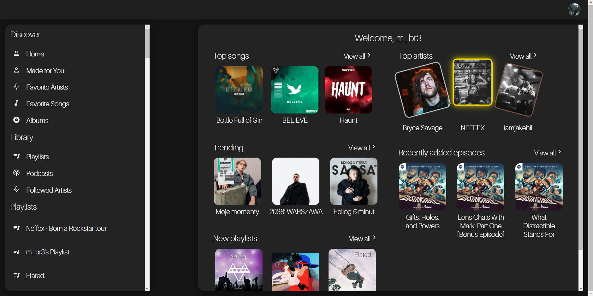

## Autor
Mikołaj Bryndal

## Temat projektu
Testowanie backendu i komponentów z aplikacji internetowej służącej do monitorowania aktywności użytkownika w serwisie muzycznym 

## Opis projektu

Aplikacja monitorująca aktywność użytkownika w serwisie muzycznym Spotify. Projekt skupia się na dostarczeniu użytkownikom spersonalizowanego i wyjątkowego doświadczenia muzycznego poprzez analizę ich preferencji i zwyczajów słuchania muzyki.



## Uruchomienie projektu

W katalogu projektu uruchomić komendy:

### npm install
### npm run dev

Powinna się otworzyć nowa karta przeglądarki z adresem: [http://localhost:3000](http://localhost:3000/)

## Uruchomienie testów jednostkowych i integracyjnych (frontend)

#### npm run testFront

## Uruchomienie testów jednostkowych i integracyjnych (backend, będzie próbował też front, ale nie ma pozwolenia do plików.jsx )
#### npm run testBack


## Dokumentacja API

- Adres usługi: ``/auth/login``
- Typ: **GET**
- Przyjmuje: 
```json 
{
    "response_type" : "code",
    "client_id": "spotify_client_id",
    "scope": "scope",
    "redirect_uri": "spotify_redirect_uri",
    "state": "state"
}

```
**Opis:** 301 na https://accounts.spotify.com/authorize/?

- Adres usługi: ``/auth/callback``
- Typ: **GET**
- Przyjmuje: 
```json 
{
    "code": "authorization_code",
    "redirect_uri": "spotify_redirect_uri",
    "grant_type": "authorization_code"
}

```
- Zwraca:
```json
    "access_token": "access_token",
    "refresh_token": "refresh_token"
```
**Opis:** Obsługuje zwrotne dane po pomyślnym uwierzytelnianiu z serwisem Spotify.


- Adres usługi: `/auth/token`
- Typ: **GET**
  ```json
  {
    "access_token ": "access_token",
  }
  
**Opis:** Zwraca token dostępu.

- Adres usługi: ``/spotify/me``
- Typ: **GET**
- Zwraca:
```json
{
  "country": "string",
  "display_name": "string",
  "email": "string",
  "explicit_content": {
    "filter_enabled": false,
    "filter_locked": false
  },
  "external_urls": {
    "spotify": "string"
  },
  "followers": {
    "href": "string",
    "total": 0
  },
  "href": "string",
  "id": "string",
  "images": [
    {
      "url": "https://i.scdn.co/image/ab67616d00001e02ff9ca10b55ce82ae553c8228",
      "height": 300,
      "width": 300
    }
  ],
  "product": "string",
  "type": "string",
  "uri": "string"
}
```
**Opis:** Zwraca dane dotyczące profilu użytkownika.


- Adres usługi: ``/spotify/topTracks``
- Typ: **GET**
- Zwraca:
```json
{
  "href": "https://api.spotify.com/v1/me/shows?offset=0&limit=20",
  "limit": 20,
  "next": "https://api.spotify.com/v1/me/shows?offset=1&limit=1",
  "offset": 0,
  "previous": "https://api.spotify.com/v1/me/shows?offset=1&limit=1",
  "total": 4,
  "items": [
    {
      "external_urls": {
        "spotify": "string"
      },
      "followers": {
        "href": "string",
        "total": 0
      },
      "genres": ["Prog rock", "Grunge"],
      "href": "string",
      "id": "string",
      "images": [
        {
          "url": "https://i.scdn.co/image/ab67616d00001e02ff9ca10b55ce82ae553c8228",
          "height": 300,
          "width": 300
        }
      ],
      "name": "string",
      "popularity": 0,
      "type": "artist",
      "uri": "string"
    }
  ]
}
```
**Opis:** Zwraca dane dotyczące najczęściej odsłuchiwanych kawałków użytkownika.

- Adres usługi: ``/spotify/topArtists``
- Typ: **GET**
- Zwraca:
```json
{
  "href": "https://api.spotify.com/v1/me/shows?offset=0&limit=20",
  "limit": 20,
  "next": "https://api.spotify.com/v1/me/shows?offset=1&limit=1",
  "offset": 0,
  "previous": "https://api.spotify.com/v1/me/shows?offset=1&limit=1",
  "total": 4,
  "items": [
    {
      "external_urls": {
        "spotify": "string"
      },
      "followers": {
        "href": "string",
        "total": 0
      },
      "genres": ["Prog rock", "Grunge"],
      "href": "string",
      "id": "string",
      "images": [
        {
          "url": "https://i.scdn.co/image/ab67616d00001e02ff9ca10b55ce82ae553c8228",
          "height": 300,
          "width": 300
        }
      ],
      "name": "string",
      "popularity": 0,
      "type": "artist",
      "uri": "string"
    }
  ]
}
```
**Opis:** Zwraca dane dotyczące najczęściej odsłuchiwanych artystów użytkownika


- Adres usługi: ``/spotify/followedArtists``
- Typ: **GET**
- Zwraca:
```json
{
  "artists": {
    "href": "string",
    "limit": 0,
    "next": "string",
    "cursors": {
      "after": "string",
      "before": "string"
    },
    "total": 0,
    "items": [
      {
        "external_urls": {
          "spotify": "string"
        },
        "followers": {
          "href": "string",
          "total": 0
        },
        "genres": [
          "Prog rock",
          "Grunge"
        ],
        "href": "string",
        "id": "string",
        "images": [
          {
            "url": "https://i.scdn.co/image/ab67616d00001e02ff9ca10b55ce82ae553c8228",
            "height": 300,
            "width": 300
          }
        ],
        "name": "string",
        "popularity": 0,
        "type": "artist",
        "uri": "string"
      }
    ]
  }
}
```
**Opis:** Zwraca dane dotyczące obserwowanych artystów użytkownika


- Adres usługi: ``/spotify/newReleases``
- Typ: **GET**
- Zwraca:
```json
{
  "albums": {
    "href": "https://api.spotify.com/v1/me/shows?offset=0&limit=20",
    "limit": 20,
    "next": "https://api.spotify.com/v1/me/shows?offset=1&limit=1",
    "offset": 0,
    "previous": "https://api.spotify.com/v1/me/shows?offset=1&limit=1",
    "total": 4,
    "items": [
      {
        "album_type": "compilation",
        "total_tracks": 9,
        "available_markets": [
          "CA",
          "BR",
          "IT"
        ],
        "external_urls": {
          "spotify": "string"
        },
        "href": "string",
        "id": "2up3OPMp9Tb4dAKM2erWXQ",
        "images": [
          {
            "url": "https://i.scdn.co/image/ab67616d00001e02ff9ca10b55ce82ae553c8228",
            "height": 300,
            "width": 300
          }
        ],
        "name": "string",
        "release_date": "1981-12",
        "release_date_precision": "year",
        "restrictions": {
          "reason": "market"
        },
        "type": "album",
        "uri": "spotify:album:2up3OPMp9Tb4dAKM2erWXQ",
        "artists": [
          {
            "external_urls": {
              "spotify": "string"
            },
            "href": "string",
            "id": "string",
            "name": "string",
            "type": "artist",
            "uri": "string"
          }
        ]
      }
    ]
  }
}
```
**Opis:** Zwraca dane dotyczące nowych, trendujących albumów


- Adres usługi: ``/spotify/shows``
- Typ: **GET**
- Zwraca:
```json
{
  "href": "https://api.spotify.com/v1/me/shows?offset=0&limit=20",
  "limit": 20,
  "next": "https://api.spotify.com/v1/me/shows?offset=1&limit=1",
  "offset": 0,
  "previous": "https://api.spotify.com/v1/me/shows?offset=1&limit=1",
  "total": 4,
  "items": [
    {
      "added_at": "string",
      "show": {
        "available_markets": [
          "string"
        ],
        "copyrights": [
          {
            "text": "string",
            "type": "string"
          }
        ],
        "description": "string",
        "html_description": "string",
        "explicit": false,
        "external_urls": {
          "spotify": "string"
        },
        "href": "string",
        "id": "string",
        "images": [
          {
            "url": "https://i.scdn.co/image/ab67616d00001e02ff9ca10b55ce82ae553c8228",
            "height": 300,
            "width": 300
          }
        ],
        "is_externally_hosted": false,
        "languages": [
          "string"
        ],
        "media_type": "string",
        "name": "string",
        "publisher": "string",
        "type": "show",
        "uri": "string",
        "total_episodes": 0
      }
    }
  ]
}
```
**Opis:** Zwraca dane dotyczące zapisanych podcastów użytkownika


- Adres usługi: ``/spotify/shows/:show_id/``
- Typ: **GET**
- Przyjmuje: 
```json
{
    "show_id": "show_id"
}
```
- Zwraca:
```json
{
  "available_markets": [
    "string"
  ],
  "copyrights": [
    {
      "text": "string",
      "type": "string"
    }
  ],
  "description": "string",
  "html_description": "string",
  "explicit": false,
  "external_urls": {
    "spotify": "string"
  },
  "href": "string",
  "id": "string",
  "images": [
    {
      "url": "https://i.scdn.co/image/ab67616d00001e02ff9ca10b55ce82ae553c8228",
      "height": 300,
      "width": 300
    }
  ],
  "is_externally_hosted": false,
  "languages": [
    "string"
  ],
  "media_type": "string",
  "name": "string",
  "publisher": "string",
  "type": "show",
  "uri": "string",
  "total_episodes": 0,
  "episodes": {
    "href": "https://api.spotify.com/v1/me/shows?offset=0&limit=20",
    "limit": 20,
    "next": "https://api.spotify.com/v1/me/shows?offset=1&limit=1",
    "offset": 0,
    "previous": "https://api.spotify.com/v1/me/shows?offset=1&limit=1",
    "total": 4,
    "items": [
      {
        "audio_preview_url": "https://p.scdn.co/mp3-preview/2f37da1d4221f40b9d1a98cd191f4d6f1646ad17",
        "description": "A Spotify podcast sharing fresh insights on important topics of the moment—in a way only Spotify can. You’ll hear from experts in the music, podcast and tech industries as we discover and uncover stories about our work and the world around us.",
        "html_description": "<p>A Spotify podcast sharing fresh insights on important topics of the moment—in a way only Spotify can. You’ll hear from experts in the music, podcast and tech industries as we discover and uncover stories about our work and the world around us.</p>",
        "duration_ms": 1686230,
        "explicit": false,
        "external_urls": {
          "spotify": "string"
        },
        "href": "https://api.spotify.com/v1/episodes/5Xt5DXGzch68nYYamXrNxZ",
        "id": "5Xt5DXGzch68nYYamXrNxZ",
        "images": [
          {
            "url": "https://i.scdn.co/image/ab67616d00001e02ff9ca10b55ce82ae553c8228",
            "height": 300,
            "width": 300
          }
        ],
        "is_externally_hosted": false,
        "is_playable": false,
        "language": "en",
        "languages": [
          "fr",
          "en"
        ],
        "name": "Starting Your Own Podcast: Tips, Tricks, and Advice From Anchor Creators",
        "release_date": "1981-12-15",
        "release_date_precision": "day",
        "resume_point": {
          "fully_played": false,
          "resume_position_ms": 0
        },
        "type": "episode",
        "uri": "spotify:episode:0zLhl3WsOCQHbe1BPTiHgr",
        "restrictions": {
          "reason": "string"
        }
      }
    ]
  }
}
```
**Opis:** Zwraca dane dotyczące konkretnego podcastu


- Adres usługi: ``/spotify/playlists``
- Typ: **GET**

- Zwraca:
```json
{
  "href": "https://api.spotify.com/v1/me/shows?offset=0&limit=20",
  "limit": 20,
  "next": "https://api.spotify.com/v1/me/shows?offset=1&limit=1",
  "offset": 0,
  "previous": "https://api.spotify.com/v1/me/shows?offset=1&limit=1",
  "total": 4,
  "items": [
    {
      "collaborative": false,
      "description": "string",
      "external_urls": {
        "spotify": "string"
      },
      "href": "string",
      "id": "string",
      "images": [
        {
          "url": "https://i.scdn.co/image/ab67616d00001e02ff9ca10b55ce82ae553c8228",
          "height": 300,
          "width": 300
        }
      ],
      "name": "string",
      "owner": {
        "external_urls": {
          "spotify": "string"
        },
        "followers": {
          "href": "string",
          "total": 0
        },
        "href": "string",
        "id": "string",
        "type": "user",
        "uri": "string",
        "display_name": "string"
      },
      "public": false,
      "snapshot_id": "string",
      "tracks": {
        "href": "string",
        "total": 0
      },
      "type": "string",
      "uri": "string"
    }
  ]
}
```
**Opis:** Zwraca dane dotyczące playlist użytkownika


- Adres usługi: ``/spotify/playlist/:playlist_id``
- Typ: **GET**
- Przyjmuje: 
```json
{
    "playlist_id" : "playlist_id"
}
- Zwraca:
```json
{
  "collaborative": false,
  "description": "string",
  "external_urls": {
    "spotify": "string"
  },
  "followers": {
    "href": "string",
    "total": 0
  },
  "href": "string",
  "id": "string",
  "images": [
    {
      "url": "https://i.scdn.co/image/ab67616d00001e02ff9ca10b55ce82ae553c8228",
      "height": 300,
      "width": 300
    }
  ],
  "name": "string",
  "owner": {
    "external_urls": {
      "spotify": "string"
    },
    "followers": {
      "href": "string",
      "total": 0
    },
    "href": "string",
    "id": "string",
    "type": "user",
    "uri": "string",
    "display_name": "string"
  },
  "public": false,
  "snapshot_id": "string",
  "tracks": {
    "href": "https://api.spotify.com/v1/me/shows?offset=0&limit=20",
    "limit": 20,
    "next": "https://api.spotify.com/v1/me/shows?offset=1&limit=1",
    "offset": 0,
    "previous": "https://api.spotify.com/v1/me/shows?offset=1&limit=1",
    "total": 4,
    "items": [
      {
        "added_at": "string",
        "added_by": {
          "external_urls": {
            "spotify": "string"
          },
          "followers": {
            "href": "string",
            "total": 0
          },
          "href": "string",
          "id": "string",
          "type": "user",
          "uri": "string"
        },
        "is_local": false,
        "track": {
          "album": {
            "album_type": "compilation",
            "total_tracks": 9,
            "available_markets": [
              "CA",
              "BR",
              "IT"
            ],
            "external_urls": {
              "spotify": "string"
            },
            "href": "string",
            "id": "2up3OPMp9Tb4dAKM2erWXQ",
            "images": [
              {
                "url": "https://i.scdn.co/image/ab67616d00001e02ff9ca10b55ce82ae553c8228",
                "height": 300,
                "width": 300
              }
            ],
            "name": "string",
            "release_date": "1981-12",
            "release_date_precision": "year",
            "restrictions": {
              "reason": "market"
            },
            "type": "album",
            "uri": "spotify:album:2up3OPMp9Tb4dAKM2erWXQ",
            "artists": [
              {
                "external_urls": {
                  "spotify": "string"
                },
                "href": "string",
                "id": "string",
                "name": "string",
                "type": "artist",
                "uri": "string"
              }
            ]
          },
          "artists": [
            {
              "external_urls": {
                "spotify": "string"
              },
              "followers": {
                "href": "string",
                "total": 0
              },
              "genres": [
                "Prog rock",
                "Grunge"
              ],
              "href": "string",
              "id": "string",
              "images": [
                {
                  "url": "https://i.scdn.co/image/ab67616d00001e02ff9ca10b55ce82ae553c8228",
                  "height": 300,
                  "width": 300
                }
              ],
              "name": "string",
              "popularity": 0,
              "type": "artist",
              "uri": "string"
            }
          ],
          "available_markets": [
            "string"
          ],
          "disc_number": 0,
          "duration_ms": 0,
          "explicit": false,
          "external_ids": {
            "isrc": "string",
            "ean": "string",
            "upc": "string"
          },
          "external_urls": {
            "spotify": "string"
          },
          "href": "string",
          "id": "string",
          "is_playable": false,
          "linked_from": {},
          "restrictions": {
            "reason": "string"
          },
          "name": "string",
          "popularity": 0,
          "preview_url": "string",
          "track_number": 0,
          "type": "track",
          "uri": "string",
          "is_local": false
        }
      }
    ]
  },
  "type": "string",
  "uri": "string"
}
```
**Opis:** Zwraca dane dotyczące konkretnej playlisty


- Adres usługi: ``/spotify/albums``
- Typ: **GET**

- Zwraca:
```json
{
  "href": "https://api.spotify.com/v1/me/shows?offset=0&limit=20",
  "limit": 20,
  "next": "https://api.spotify.com/v1/me/shows?offset=1&limit=1",
  "offset": 0,
  "previous": "https://api.spotify.com/v1/me/shows?offset=1&limit=1",
  "total": 4,
  "items": [
    {
      "added_at": "string",
      "album": {
        "album_type": "compilation",
        "total_tracks": 9,
        "available_markets": [
          "CA",
          "BR",
          "IT"
        ],
        "external_urls": {
          "spotify": "string"
        },
        "href": "string",
        "id": "2up3OPMp9Tb4dAKM2erWXQ",
        "images": [
          {
            "url": "https://i.scdn.co/image/ab67616d00001e02ff9ca10b55ce82ae553c8228",
            "height": 300,
            "width": 300
          }
        ],
        "name": "string",
        "release_date": "1981-12",
        "release_date_precision": "year",
        "restrictions": {
          "reason": "market"
        },
        "type": "album",
        "uri": "spotify:album:2up3OPMp9Tb4dAKM2erWXQ",
        "artists": [
          {
            "external_urls": {
              "spotify": "string"
            },
            "href": "string",
            "id": "string",
            "name": "string",
            "type": "artist",
            "uri": "string"
          }
        ],
        "tracks": {
          "href": "https://api.spotify.com/v1/me/shows?offset=0&limit=20",
          "limit": 20,
          "next": "https://api.spotify.com/v1/me/shows?offset=1&limit=1",
          "offset": 0,
          "previous": "https://api.spotify.com/v1/me/shows?offset=1&limit=1",
          "total": 4,
          "items": [
            {
              "artists": [
                {
                  "external_urls": {
                    "spotify": "string"
                  },
                  "href": "string",
                  "id": "string",
                  "name": "string",
                  "type": "artist",
                  "uri": "string"
                }
              ],
              "available_markets": [
                "string"
              ],
              "disc_number": 0,
              "duration_ms": 0,
              "explicit": false,
              "external_urls": {
                "spotify": "string"
              },
              "href": "string",
              "id": "string",
              "is_playable": false,
              "linked_from": {
                "external_urls": {
                  "spotify": "string"
                },
                "href": "string",
                "id": "string",
                "type": "string",
                "uri": "string"
              },
              "restrictions": {
                "reason": "string"
              },
              "name": "string",
              "preview_url": "string",
              "track_number": 0,
              "type": "string",
              "uri": "string",
              "is_local": false
            }
          ]
        },
        "copyrights": [
          {
            "text": "string",
            "type": "string"
          }
        ],
        "external_ids": {
          "isrc": "string",
          "ean": "string",
          "upc": "string"
        },
        "genres": [
          "Egg punk",
          "Noise rock"
        ],
        "label": "string",
        "popularity": 0
      }
    }
  ]
}
```
**Opis:** Zwraca dane dotyczące zapisanych albumów użytkownika


- Adres usługi: ``/spotify/checkSavedEpisode/:episode_id``
- Typ: **GET**
- Zwraca:
```json
[false, true ]

```
**Opis:** Sprawdza czy dany odcinek podcastu jest zapisany czy nie i zwraca odpowiednio true / false


## Scenariusze testowe dla testera manualnego

| Test Case ID | Opis | Kroki testowe | Oczekiwany wynik |
| ---------| ---------| ---------| ---------|
| TC_01 | Zalogowanie się na konto Spotify | 1.Kliknij przycisk "Login with spotify" i podaj swoje dane logowania | Pojawienie się panelu głównego|
| TC_02 | Pokaż profil użytkownika | Kliknij w avatar w prawym górnym rogu i wybierz "Profile" | Pojawienie się komponentu z danymi użytkownika|
| TC_03 | Wyloguj | Kliknij w avatar w prawym górnym rogu i wybierz "Logout" | Pojawienie się komponentu z przyciskiem "Login with spotify" |
| TC_04 | Przeglądanie nowych wydań | Kliknij w "Made for You" w lewym panelu bocznym | Pojawienie się komponentu z nowymi wydaniami |
| TC_05 | Pokaż ulubionych artystów | Kliknij w "Favorite Artists" w lewym panelu bocznym | Pojawienie się komponentu zawierającego ulubionych artystów użytkownika |
| TC_06 | Pokaż ulubione utwory  | Kliknij w "Favorite Songs" w lewym panelu bocznym |Pojawienie się komponentu zawierającego ulubione utwory użytkownika wraz z: 1. Wykresem przedstawiającym dystrybucje artystów w playliście, 2. Wykresem przedstawiającym dystrybucje gatunków jeśli jest ona przypisana do artysty |
| TC_07 | Pokaż playlisty użytkownika | Kliknij w "Playlists" | Pojawienie się komponentu z playlistami użytkownika |
| TC_08 | Pokaż playliste użytkownika | Będąc w "Playlists", kliknij na daną playliste lub bezpośrednio kliknij na jedną z panelu bocznego | Pojawienie się komponentu z danymi playlisty wraz z wykresami takimi jak w teście 06 |
| TC_09 | Pokaż obserwowanych artystów | Kliknij w "Followed Artists" | Pojawienie się komponentu z obserwowanymi artystami użytkownika wraz z gatunkami, jeśli isnieją |
| TC_10 | Pokaż zapisane albumy | Kliknij "Albums" | Pojawienie się komponentu z zapisanymi albumami wraz z bubble chart'em (TODO) |

## Technologie użyte w projekcie
### Front-end:
* React
* Redux
* Sass
* Webpack
* Material UI
### Back-end:
* Node.js
* Express.js
### Testowanie:
* supertest
* jest
* react-testing-library
